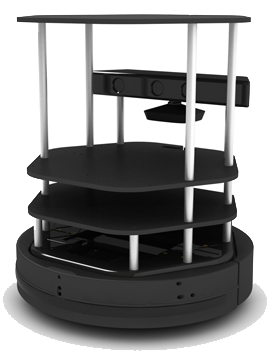

# TurtleBot2 Main Repo

The top level repo for the TurtleBot2 code.  Builds the workspace and the Kobuki drivers.  Also has some basic launch files to drive the TurtleBot2.

Tested using

* ROS Lyrical and Ubuntu 26.04LTS (using the docker in this repo).

## Objective

To run the Turtlebot2 using a Raspberry Pi4.  The robot should then be able to map the room and navigate between two set points avoiding obstacles and replanning as required.

## Setup and building

TO DO

Rebuild docker after sorting out ROS_DISTRO stuff.

Orbbec camera and random walker build issues.

## Running the code

TODO

## Documents

* [Workspace set up](setup.md)
* [Build instructions](build.md)
* [Running the TurtleBot2](running.md)
* [Notes on building the code](build_notes.md)

## Acknowledgments

© 2026, University of Leeds.

The author, A. Blight, has asserted his moral rights.
